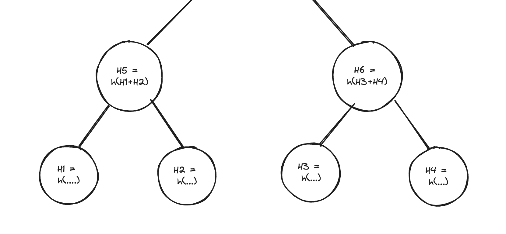
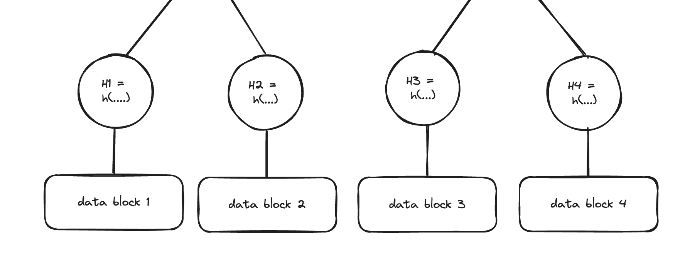
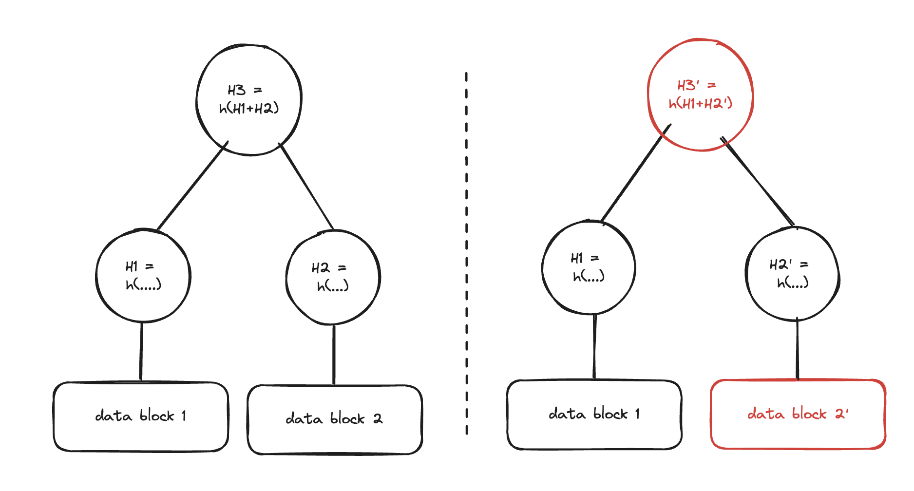
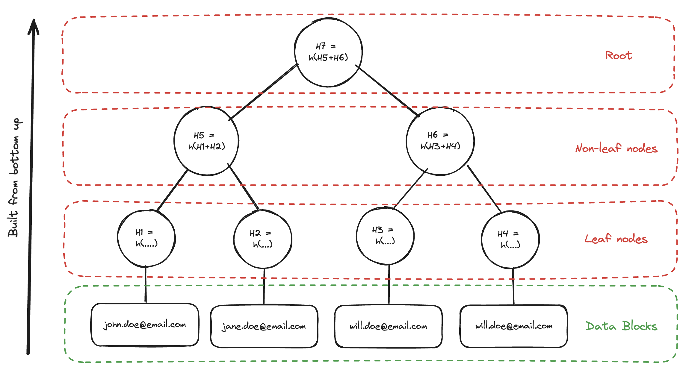
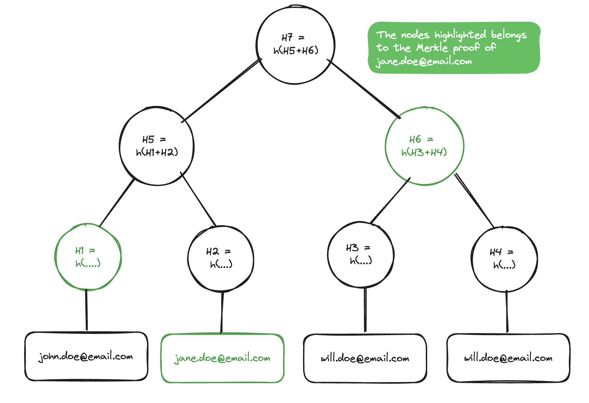
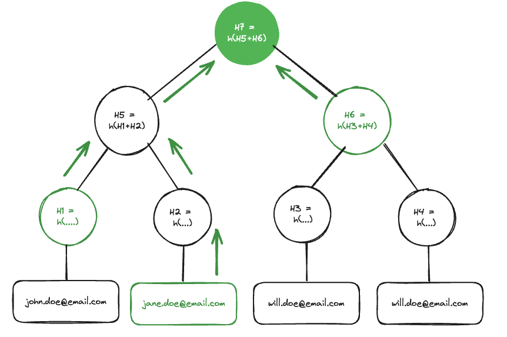

# Exploring blockchain basics: An overview of Merkle trees and their usage

## What is a Merkle tree?

Merkle trees are a fundamental component of blockchain technology and they have been widely used in other fields of Computer Science for data verification and synchronization. The concept of Merkle trees is named after [Ralph Merkle](https://en.wikipedia.org/wiki/Ralph_Merkle), who patented it in 1979.

 They are essentially binary trees composed of hashes and their primary function is to verify the integrity of data, ensuring that the information remains unaltered and intact. In the structure of a Merkle tree, each non-leaf node is the hash of the values of its child nodes, effectively creating a chain of interconnected information.

On the other hand, the leaf nodes, which form the base of the tree, are hashes of the input data, serving as the primary source of information. This unique and highly efficient structure allows for the secure verification of the contents of large data structures.

One of the key advantages of a Merkle tree is that any change in a single element, regardless of how minor, results in a change in the root hash. This makes it possible to quickly and accurately detect any changes or alterations in the data.

In essence, Merkle trees play an indispensable role in maintaining the security and integrity of blockchain technology.

## Building a Merkle tree

A Merkel tree is built from the bottom up, and the process of constructing a Merkle tree involves several crucial steps:

1. **Hash the input data**: Each piece of input data is hashed individually to create the leaf nodes of the Merkle tree.
2. **Pair up the hashes**: The hashes are then paired up. If there is an odd number of hashes, the last hash is duplicated.
3. **Hash the pairs**: Each pair of hashes is concatenated and then hashed again to create the parent node.
4. **Repeat**: Steps 2 and 3 are repeated until there is only one hash left, which becomes the root of the Merkle tree.

Remember, any change in the input data will result in a change in the root hash, allowing efficient and secure verification of large data structures.

In the example below we show how to create a Merkel tree from a list of emails.

**Important:** Notice that the value for the last leaf is duplicated because the example uses an odd number of inputs.

Now that you understand how a Merkel tree is built we can focus on its capabilities. Let's look into Merkle Proofs.

## Merkle Proofs

A Merkle Proof, also known as a Merkle Path, is a crucial component of a Merkle tree. This proof is essentially a method for validating the inclusion of a specific piece of data in a block using the structure of the Merkle tree. The proof works by providing a computed path from the root of the tree down to the specific leaf node representing the data in question.

The Merkle Proof is a sequence of hashes from the root of the tree to the specific leaf node. This sequence, along with the necessary sibling nodes for hash calculations, forms the proof of inclusion. The sibling nodes are required because each parent node in a Merkle tree is a hash of its two child nodes. To compute the hash of a parent node, you need both child nodes.

To verify the data using a Merkle Proof, the recipient starts with the specific leaf node and the sibling node provided in the proof. They hash these two nodes together to get the hash of the parent node. They then move up the tree, hashing each provided node with its sibling, until they reach the root. If the calculated root matches the provided root, the data is verified as being included in the set.

## Wrapping up

In essence, the Merkle Proof leverages the unique properties of the Merkle tree to provide a reliable and efficient way to prove the inclusion of a specific piece of data in a set, without needing to have the entire data set. This makes it particularly useful in distributed systems and blockchain technology where efficiency and data integrity are paramount.
